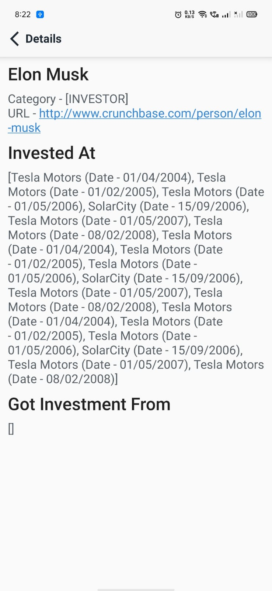

# Netcore
I have retrieved data from https://doc.linkurio.us/ogma/latest/resources/files/solarCity.json, and tried to represent this data as a graph, and the relevan code can be found in `data/Graph.kt` file. Due to time-shortage was not able to completely represent everything, but the created graph will help reduce the work later.

Tried representing relationship(edges) among investors and companies as `Invested At` and `Got Investment From` inside the app.

## Screenshots
|     |Light UI|Dark UI|
|-----|--------|-------|
|Nodes List|||
|Nodes Details|||
